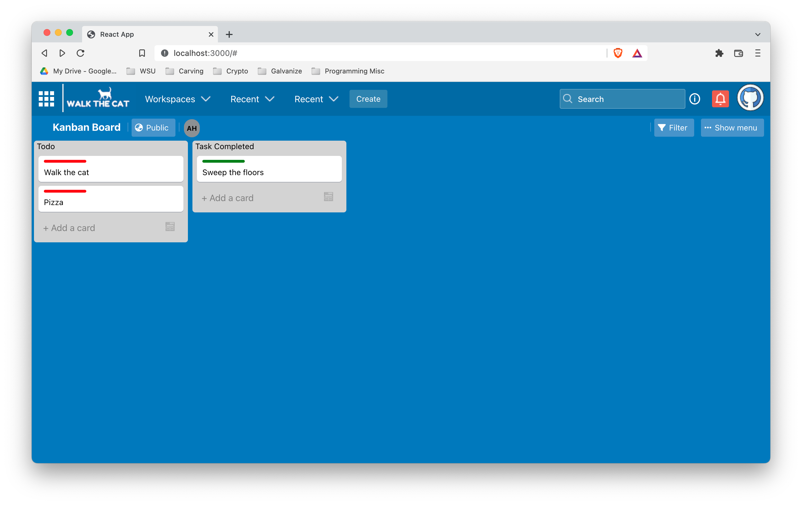

<!-- PROJECT LOGO -->
 

  

  <h3 align="center">Walk the Cat</h3>

  

    Walk the Cat has got your back!
     
    <a href="https://github.com/walk-the-cat/walk-the-cat/issues">Report Bug</a>
    ·
    <a href="https://github.com/walk-the-cat/walk-the-cat/issues">Request Feature</a>
  

<!-- TABLE OF CONTENTS -->

  
Table of Contents

  <ol>
    <li>
      <a href="#about-the-project">About The Project</a>
      <ul>
        <li><a href="#built-with">Built With</a></li>
      </ul>
    </li>
    <li><a href="#roadmap">Roadmap</a></li>
    <li><a href="#contributing">Contributing</a></li>
    <li><a href="#contact">Contact</a></li>
  </ol>

<!-- ABOUT THE PROJECT -->
## About The Project

Cats love the outdoors but have you ever tried to walk your cat on a leash? You may have noticed that the training isn’t so easy and that a fun outing ends up looking something like this...

Here's why:
 * You weren't using a Walk the Cat Kanban Board!

Walk the Cat's kanban board offers you the perfect tool to plan and track the many tasks you must do to correctly and lovingly train that stubborn cat. Everything from tracking which collar and harness you need to when you must get more treats. <i>Walk the Cat has got your back!</i> 

(<a href="#top">back to top</a>)

### Built With

* [Node.js](https://nodejs.org/en/docs/)
* [React.js](https://reactjs.org/)
* [Axios](https://axios-http.com/docs/intro)
* [Recoil.js](https://recoiljs.org/)

(<a href="#top">back to top</a>)

<!-- ROADMAP -->
## Roadmap

- [x] Add back to top links in README
- [ ] Add Card Templates w/ Examples
- [ ] Integrate Login and Accounts Feature
- [ ] Enable Multiple Types of Kanban Boards

See the [open issues](https://github.com/walk-the-cat/walk-the-cat/issues) for a full list of proposed features (and known issues).

(<a href="#top">back to top</a>)

<!-- CONTRIBUTING -->
## Contributing

Contributions are what make the open source community such an amazing place to learn, inspire, and create. Any contributions you make are **greatly appreciated**.

If you have a suggestion that would make this better, please fork the repo and create a pull request. You can also simply open an issue with the tag "enhancement".
Don't forget to give this project a star! Thanks again!

1. Fork the Project
2. Create your Feature Branch (`git checkout -b feature/AmazingFeature`)
3. Commit your Changes (`git commit -m 'Add some AmazingFeature'`)
4. Push to the Branch (`git push origin feature/AmazingFeature`)
5. Open a Pull Request

(<a href="#top">back to top</a>)

<!-- CONTACT -->
## Contact

Project Link: [https://github.com/walk-the-cat/walk-the-cat](https://github.com/walk-the-cat/walk-the-cat)

(<a href="#top">back to top</a>)

